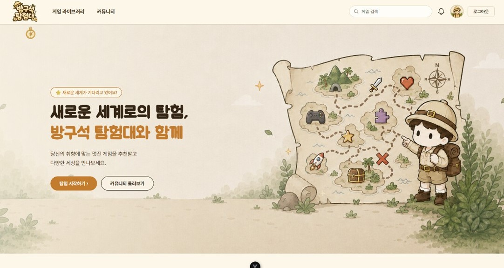
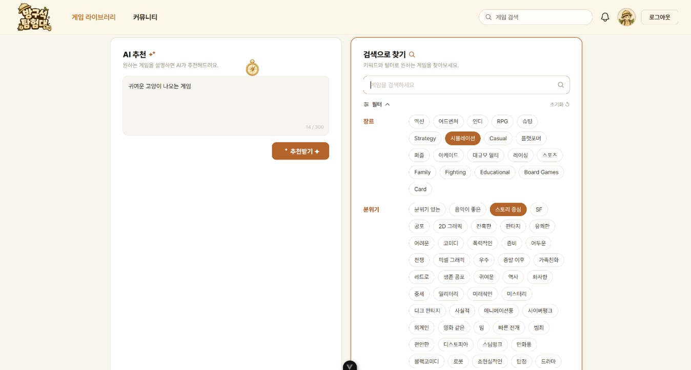
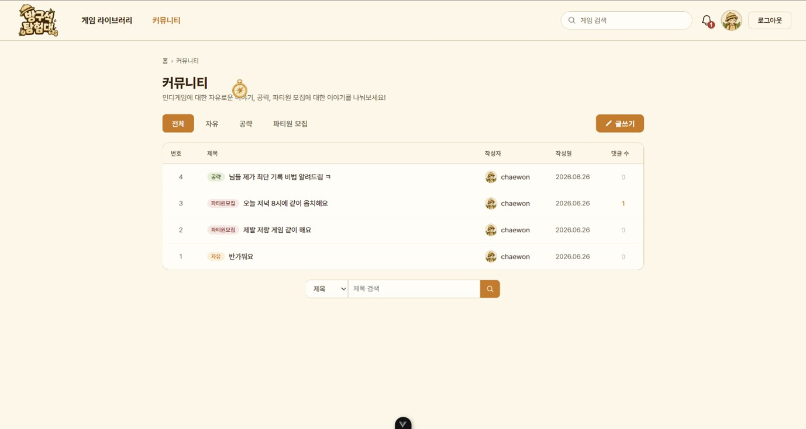
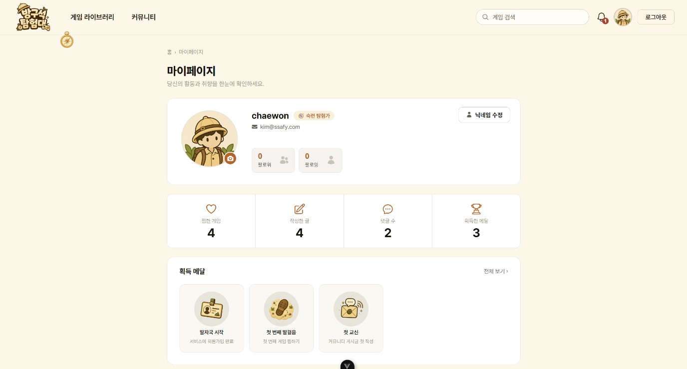
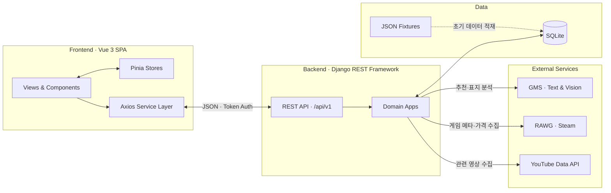

# 🎮 방구석 탐험대

> 사용자가 원하는 플레이 경험을 자연어로 설명하면, 실제 게임 데이터베이스 안에서 취향에 맞는 인디 게임을 찾아 주는 AI 기반 추천 서비스



## 프로젝트 정보

| 항목 | 내용 |
|---|---|
| 개발 기간 | 2026.06.22 ~ 2026.06.26 |
| 개발 인원 | 2명 |
| 프로젝트 형태 | SSAFY 최종 관통 프로젝트 |
| 서비스 상태 | 로컬 실행 지원 |
| 프론트엔드 | Vue 3, Pinia, Vue Router, Axios, Vite |
| 백엔드 | Django 5.2, Django REST Framework, SQLite |
| AI·외부 데이터 | GMS, RAWG, Steam, YouTube Data API |

## 문제 정의

인디 게임은 작품 수가 많고 장르·태그가 세분되어 있어, 사용자가 정확한 게임명이나 분류를 모르면 원하는 게임을 발견하기 어렵습니다. 방구석 탐험대는 사용자가 “친구와 가볍게 할 수 있는 픽셀 협동 게임”처럼 원하는 경험을 자연어로 표현할 수 있게 하고, 이를 서비스가 보유한 게임 데이터와 연결해 탐색 비용을 줄이는 것을 목표로 했습니다.

LLM이 게임을 직접 선택하게 하면 데이터베이스에 없는 게임을 제안할 수 있기 때문에, LLM은 사용자 의도 해석과 추천 이유 생성에만 사용합니다. 실제 후보 선정은 DB 필터링과 점수화 로직이 담당하도록 분리했습니다.

## 주요 화면

| AI 추천 및 검색 | 필터 검색 |
|---|---|
|  |  |

| 게임 라이브러리 | 게임 상세 |
|---|---|
|  |  |

| 커뮤니티 | 마이페이지 |
|---|---|
|  |  |

더 많은 화면은 [docs/screenshots](docs/screenshots)에서 확인할 수 있습니다.

## 구현 기능

### 게임 탐색

- RAWG·Steam 기반 게임 메타데이터와 가격 정보 제공
- 키워드 자동 완성 및 장르·분위기·플랫폼·가격 필터 검색
- 할인 게임, 신작 게임, 취향 기반 추천 목록 제공
- 게임 상세 정보, 스크린샷, 관련 YouTube 영상 제공

### AI 추천

- 자유 문장에서 장르·무드·소재·가격 등의 의도 추출
- DB 어휘 보정 후 실제 보유 게임만 필터링·점수화
- 후보별 추천 이유와 관련도 생성
- 찜 목록과 최근 추천 기록을 활용한 홈 취향 분석
- 게임 표지의 시각 소재를 분석해 추천 태그로 활용

### 사용자·커뮤니티

- 회원가입, 로그인, 로그아웃 및 프로필 수정
- 찜 목록, 추천 기록, 작성 게시글 모아보기
- 팔로우·팔로잉, 활동 메달, 알림
- 게시글·이미지·댓글 작성, 수정, 삭제
- 404 안내 화면

## AI 추천 파이프라인

```text
사용자 자연어 입력
        │
        ▼
① 의도 추출(GMS)
   genres / moods / subjects / price_max / 제외 조건
        │
        ▼
② DB 어휘 보정 + 필터·가중 점수화
   rapidfuzz로 실제 태그에 정규화하고 보유 게임만 후보로 선정
        │
        ▼
③ 추천 이유·관련도 생성(GMS)
        │
        ▼
RecommendationLog / RecommendationResult 저장 및 화면 표시
```

GMS가 설정되지 않았거나 호출에 실패해도 DB 기반 대체 추천으로 주요 흐름을 시연할 수 있습니다.

## 아키텍처



주요 도메인 모델은 다음과 같습니다.

| 앱 | 핵심 모델 |
|---|---|
| accounts | `User`, `Follow`, `Medal`, `UserMedal`, `Notification` |
| games | `Game`, `Genre`, `Platform`, `Mood`, `Screenshot`, `GameVideo`, `SearchLog` |
| recommendations | `RecommendationLog`, `RecommendationResult` |
| wishlists | `Wishlist` |
| community | `Post`, `PostImage`, `PostComment` |

ERD 원본은 [ERDCloud](https://www.erdcloud.com/d/tPKQ2HYRFfDPEmqgf)에서 확인할 수 있습니다.

## 기술적 의사결정

### 1. 추천 후보 선택과 문장 생성을 분리

- 문제: LLM에 게임 선택을 모두 맡기면 미보유 게임을 생성하거나 결과가 일정하지 않을 수 있었습니다.
- 해결: LLM은 의도 추출과 설명만 담당하고, 후보는 DB의 필터·점수화 로직이 결정합니다.
- 효과: 추천 결과를 실제 서비스 데이터로 제한하고, 실패 시에도 DB 기반 폴백을 적용할 수 있습니다.

### 2. YouTube 영상을 온디맨드로 수집·캐싱

- 문제: 모든 게임의 영상을 미리 수집하면 API 쿼터와 초기 적재 시간이 크게 증가합니다.
- 해결: 게임 상세 정보와 영상 API를 분리하고, 영상이 없는 게임을 처음 조회할 때만 YouTube API를 호출해 저장합니다.
- 효과: 상세 정보는 먼저 표시하고 외부 API 호출과 쿼터 사용을 줄였습니다.

### 3. 탐색 상태 복원

- 문제: 게임 상세 페이지를 확인한 뒤 돌아오면 검색어·필터·페이지가 초기화되었습니다.
- 해결: 탐색 상태를 Pinia에 저장하고 복귀 시 동일 조건으로 서버 데이터를 다시 조회합니다.
- 효과: 사용자가 이전 탐색 맥락을 유지할 수 있습니다.

### 4. API 키 없는 기본 시연

- 문제: 평가자가 외부 API 키를 갖고 있지 않으면 핵심 화면을 확인하기 어렵습니다.
- 해결: 게임·메달 fixture와 추천 폴백을 제공했습니다.
- 효과: 외부 키 없이도 홈, 게임 목록, 일반 검색과 기본 추천 흐름을 실행할 수 있습니다.

## 팀 구성과 담당 역할

| 담당 | 역할 |
|---|---|
| 장민화 | 프론트엔드 개발, 화면·컴포넌트 구현, Pinia 상태 관리, API 연동, UI 시안 및 발표 자료 |
| 김채원 | 백엔드 개발, 도메인 모델·REST API, 데이터 수집 파이프라인, AI 추천 로직 |
| 공동 | 요구사항 정의, ERD·와이어프레임, URL·API 설계 |

### 개인 기여 — 장민화

- 홈, 게임 탐색·상세, 커뮤니티, 프로필, 인증 화면 구현
- 공통 게임 카드·검색 자동 완성·페이지네이션·토스트·알림 UI 컴포넌트화
- Pinia를 이용한 인증·탐색·알림 상태 관리
- Axios 요청·응답 인터셉터와 도메인별 API 서비스 레이어 구성
- 검색 조건 즉시 반영, 상세 화면 복귀 시 탐색 상태 복원 등 사용자 흐름 개선
- 서비스 콘셉트에 맞춘 반응형 레이아웃, 메달 이미지, 커서·나침반 인터랙션 구현

## 프로젝트 구조

```text
game-explorer/
├── frontend/              # Vue 3 SPA
│   ├── src/views/         # 라우트 단위 화면
│   ├── src/components/    # 도메인·공통 UI 컴포넌트
│   ├── src/stores/        # Pinia 상태 관리
│   └── src/api/           # Axios 클라이언트·서비스 계층
├── backend/               # Django REST API
│   ├── accounts/          # 인증·프로필·팔로우·메달·알림
│   ├── games/             # 게임·검색·외부 데이터
│   ├── recommendations/   # AI 추천·추천 기록
│   ├── wishlists/         # 찜
│   └── community/         # 게시글·댓글·이미지
└── docs/                  # 기획서와 서비스 화면
```

## 로컬 실행

### 사전 요구사항

- Python 3.10 이상
- Node.js 22.18 이상 또는 24.12 이상

### 1. 백엔드

```powershell
cd backend
Copy-Item .env.example .env
python -m venv venv
.\venv\Scripts\Activate.ps1
pip install -r requirements.txt
python manage.py migrate
python manage.py loaddata games
python manage.py loaddata medals
python manage.py runserver
```

### 2. 프론트엔드

새 PowerShell 창에서 실행합니다.

```powershell
cd frontend
Copy-Item .env.example .env
npm install
npm run dev
```

- 서비스: `http://127.0.0.1:5173`
- API: `http://127.0.0.1:8000/api/v1/`
- Swagger UI: `http://127.0.0.1:8000/api/v1/docs/`

기본 화면·게임 목록·일반 검색은 외부 API 키 없이 fixture 데이터로 확인할 수 있습니다. AI 추천의 GMS 호출과 외부 데이터 수집은 [backend/.env.example](backend/.env.example)의 해당 키를 설정한 경우에만 사용합니다.

## 구현 범위와 개선 과제

| 구분 | 내용 |
|---|---|
| 구현 완료 | AI 추천, 검색·필터, 게임 상세, 영상 캐싱, 찜, 커뮤니티, 팔로우, 메달, 알림 |
| 현재 제약 | SQLite와 로컬 파일 저장소 사용, 로컬 실행 중심, 자동화된 프론트엔드 테스트 미구성 |
| 개선 과제 | 비밀번호 재설정·회원 탈퇴 완성, 게시글 신고·북마크, 접근성 점검, 이미지 최적화, 배포 환경 분리, 테스트·CI 구축 |

## 상세 문서

- [프론트엔드 README](frontend/front_README.md)
- [백엔드 README](backend/back_README.md)
- [프로젝트 기획서](docs/광주1반_11조_인디게임_추천_서비스.docx)
- [서비스 화면 모음](docs/screenshots)
